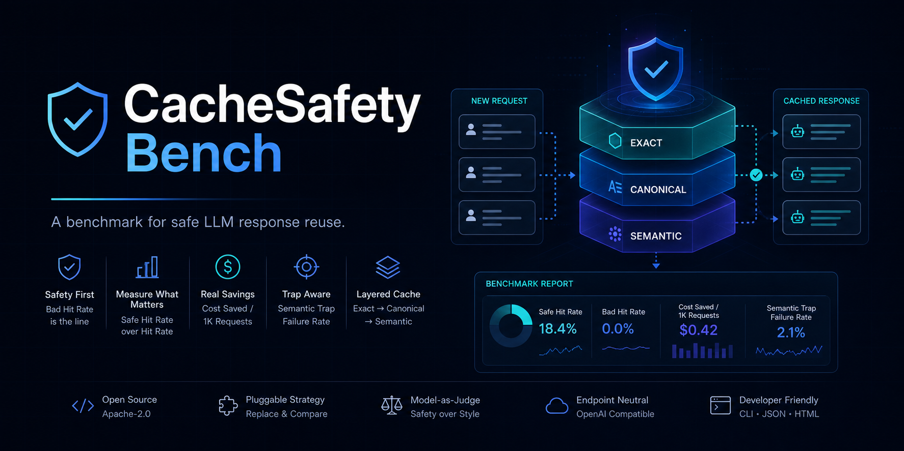

# CacheSafety Bench

> A benchmark for safe LLM response reuse.



Most cache benchmarks optimize hit rate. CacheSafety Bench measures Safe Hit Rate, Bad Hit Rate, and Cost Saved.

```bash
cachesafetybench run \
  --dataset examples/support_pairs.jsonl \
  --config configs/default.yaml \
  --output reports/example-report.html
```

```bash
export OPENAI_API_KEY=...
export OPENAI_BASE_URL=https://api.openai.com/v1
```

```bash
export OPENAI_API_KEY=...
export OPENAI_BASE_URL=https://api.nextmodel.app/v1
export OPENAI_MODEL=your-model-id
```

```bash
go run ./cmd/benchmark \
  -dataset testdata/benchmark/synthetic_v0.jsonl \
  -observe \
  -model "$OPENAI_MODEL"
```

Local toy runs still simulate cache in-process (`-scorecard lab`, the default). `-observe` scores the gateway's `x-nextmodel-serve-mode` instead of the local pipeline. `-scorecard publication` uses promptset v3 and the NextModel hosted bench formula; it requires `-observe` and does not replace the lab runner. CacheSafety Bench is endpoint-neutral. NextModel is an optional hosted endpoint example, not a requirement.

## What is CacheSafety Bench?

CacheSafety Bench is an open benchmark for measuring whether a previously generated LLM API response can safely answer a new request.

This project is not a generic semantic cache, and it is not a model router. It evaluates:

- whether an old response can safely answer a new request
- whether reuse introduces a bad hit
- how much API cost can be saved while keeping Bad Hit Rate near zero

## Why hit rate is the wrong metric

Raw hit rate can look good while users still notice reused answers are wrong, stale, or off-constraint.

CacheSafety Bench follows five principles:

- Do not optimize hit rate. Optimize Safe Hit Rate.
- Bad Hit Rate is the safety line.
- A cache hit is only useful if the user would not notice the answer was reused.
- Semantic cache is not automatically safe.
- High-risk reuse for medical, legal, and financial prompts is out of scope.

## Core metrics

- Safe Hit Rate
- Bad Hit Rate
- Severe Bad Hit Count
- Cost Saved / 1K Requests
- Net Saving Rate
- Semantic Trap Failure Rate
- Cache Layer Contribution: exact / canonical / semantic

See [docs/metrics.md](docs/metrics.md) for lab vs publication definitions and formulas.

## Quick start

1. Install Go 1.26+.
2. Run the benchmark with the bundled toy dataset.

```bash
go run ./cmd/cachesafetybench run \
  --dataset examples/support_pairs.jsonl \
  --config configs/default.yaml \
  --output reports/example-report.html
```

The public wrapper reads the dataset and config, runs the benchmark locally, writes a JSON report, and writes an HTML report when requested.

## Publication e2e loop

A Go-only loop walks all 50 promptset v3 calls through observe + publication scoring against an in-process OpenAI-compatible httptest gateway. It does not call NextModel and does not need `OPENAI_API_KEY`.

```bash
go test ./internal/benchmark -run PublicationE2E -count=1
```

Repeat to check flakes:

```bash
make e2e-loop
# or
./scripts/e2e.sh 3
```

CI runs this as part of `go test ./...`.

## Dataset format

Datasets are JSONL files built around `old_request`, `old_answer`, and `new_request`, with optional `fresh_answer` for offline reference evaluation.

See [docs/dataset-format.md](docs/dataset-format.md).

## Strategy interface

The benchmark runner is fixed. The cache decision strategy is replaceable.

See [docs/strategy-interface.md](docs/strategy-interface.md).

## Judge rubric

The benchmark asks whether the old answer safely answers the new request, not whether it is merely stylistically similar.

See [docs/judge-rubric.md](docs/judge-rubric.md).

## Report output

The public wrapper emits a compact JSON report plus an optional HTML summary.

See [docs/report-format.md](docs/report-format.md).

## Example use cases

- Evaluate whether exact and canonical reuse is already enough for a support assistant.
- Measure whether semantic reuse helps before enabling it in production.
- Build semantic trap sets before trusting cost-saving claims.
- Compare strategy layers by safety contribution instead of raw hit rate.

## NextModel hosted option

CacheSafety Bench is open source and works with any OpenAI-compatible endpoint.

NextModel can be used as an optional hosted endpoint or production gateway example. It is not required for local benchmark runs.

To score what a live NextModel-shaped gateway actually served, point `OPENAI_BASE_URL` at the gateway and pass `-observe`. Add `-scorecard publication` to emit the hosted-page scorecard on `examples/promptset_v3.json`. That path records serve-mode and receipt headers. It does not replace the default in-process cache simulation.

See [docs/nextmodel-integration.md](docs/nextmodel-integration.md).

## Roadmap

The current public release focuses on benchmark core, toy datasets, truthful docs, and minimal CI.

See [docs/roadmap.md](docs/roadmap.md).

## Contributing

See [CONTRIBUTING.md](CONTRIBUTING.md).

## Security

See [SECURITY.md](SECURITY.md).

## License

Apache-2.0. See [LICENSE](LICENSE).
